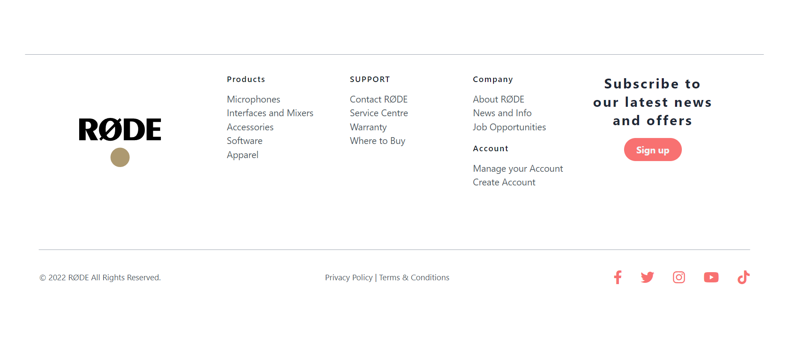

# RODE CLONE
 

 

## Skills learnt :
- Designing using only **Tailwind** by reading through the docs with minimal or no **Css**. 
- Designing **Header**, **Hero**, **Cards**, **Blog**, **Call to action** and much more.
- Got more knowledge on making **Responsive design**.
***
## Time taken :
- 10+ hours to complete this project. (Worth the time spent, Great learning!!!)
***
## Project screenshots :

